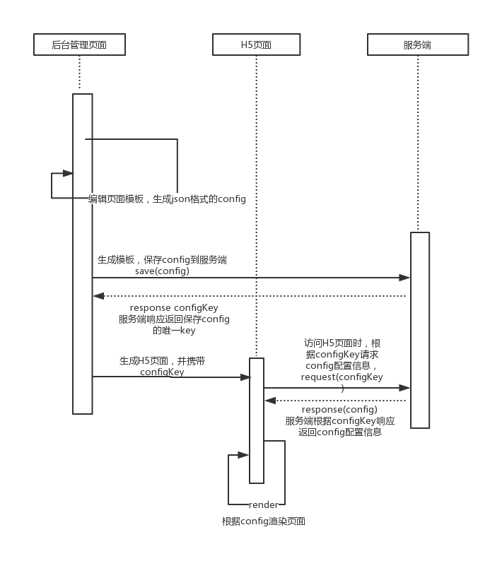

## 页面模板需求
### 1.	整体目标
实现类似于有赞微页面编辑的功能，通过对基础组件的组合形成一个全新的页面，可在公众号等地方访问。
### 2.	流程




* 2.1 后台管理页面通过组件拼接的方式形成一个页面模板，该模板是一个配置文件，包括每个组件的名称、位置、大小、主题样式等属性以及组件要映射的数据
* 2.2 页面模板形成后，需要将配置信息保存到服务端，并以一个唯一的key作为标识，
* 2.3 页面模板生成的页面的url格式为：http://wx.wakedata.com/wdh5#/feature/[key],其中key就是配置文件的唯一标识，如：

   ```angular2html
    http://wx.wakedata.com/wdh5#/feature/2411711646654bb0829145c0cb3de1eb
   ```
* 2.3 当访问这个页面时，通过解析url path，拿到key，然后在页面中根据key拉取该页面的配置信息，vue根据该配置文件通过动态组件的方式控制页面的展示和交互。  
 
### 3.模块
* 3.1	后台管理页面
	* 3.1.1 组件的添加、删除、拖拽排序：目的是形成页面的整体框架和布局
	* 3.1.2 各个组件的样式调整：背景、大小、颜色等
	* 3.1.3 各个组件的数据绑定：数据来源包括素材管理以及相关预先上传的数据源（如商品分组以及各个分组下的商品信息等）
* 3.2	H5页面
	* 3.2.1	封装各个基础组件，包括属性的动态配置，数据的展示以及事件的处理
	* 3.2.2	基础组件间的事件处理，数据间的相关影响-尽量减少组件间的交互
	* 3.2.3	Index页面，根据配置文件动态展示各个基础组件
	* 3.2.4	页面的授权流程

## 解决方案：
### 创建模板页面
* 通过添加组件、删除组件的方式生成要展示的组件list
* 通过拖拽的方式对组件list进行排序：https://github.com/SortableJS/Vue.Draggable
* 通过对每个组件的属性进行编辑实现各个组件的动态变化
* 可添加素材库以及数据源供组件调用和展示

### H5页面 -VUE
* 创建一个个独立的组件
* H5页面的动态展示：vue动态组件加载
* 微信网页授权

## 开发计划
### 2018-08-20~2018-08-26
* 0 本周目标：
	* 0.1 跑通整个页面模板的流程：包括创建模板、生成页面等
	* 0.2 完成一个典型的模板示例

* 1.跑通流程要做的事情：
	* 1.1 定义模板配置文件：包括配置文件的结构以及关键、必须、不可变更的字段 0.5d
	* 1.2 配置文件的保存与获取：与服务端联调 0.5d 
	* 1.3 h5 index页面：根据配置文件动态展示各个基础组件 暂不计算时间，只是组装各个组件
	* 1.4 支持组件的添加、删除、排序，可先定义几个粗糙的示例组件 1d
	* 1.5 支持组件调整属性：包括文案展示、背景以及颜色等，可先定义几个粗糙的可以改变属性的示例组件 1d
	* 1.6 支持组件数据绑定：数据来源包括素材管理以及相关预先上传的数据源（如商品分组以及各个分组下的商品信息等），可先定义一个可以绑定数据的组件 1d
* 2 页面模板示例要做的事情：
	* 2.1.商品组件 1d
	* 2.2.tab组件 1d

## 开发规范
### 配置文件
* config的结构以json的形式表现，最外层是一个JSON Object，包括：
	* page: page是一个JSON Object，是对整个页面的配置，包括：
		* title: 标题
		* desc: 页面描述，分享到朋友圈后会展示页面的描述信息
		* background: 页面的背景色，#+16进制的颜色值,如#ffdd82
		* ...
	* components: components是一个JSON Array，页面要展示的所有组件，Array的顺序就是组件在页面中展示的顺序，组件的配置包括： 
		* name: 组件名，需要与H5页面中的组件名保持一致
		* prop: 是组件的所有属性的自定义配置，不同的组件有不同的配置
	
	```java
	h5Config:
	{
		page: {
			title: 我的微页面,
			desc: 分享我，会看到我对这个微页面的描述
			background: #ffccdd
		},
		components: [
		    {
		      name: 'banner',
		      prop: { bg: 'https://openfile.meizu.com/group1/M00/05/F1/Cgbj0VtqgnWADjmlAAipoSE4bZM493.png680x680.jpg', width: 400, height: 200 }
		    },
		    {
		      name: 'goods',
		      prop: { icon: 'https://openfile.meizu.com/group1/M00/05/F1/Cgbj0VtqgnWADjmlAAipoSE4bZM493.png680x680.jpg', title: 'meizu 16', desc: '真正的牛刀', 'price': 2899 }
		    }
		]
	}
	```
### 组件的定义
* 组件的名字必须以Wd开头，Wd是wake data的简写
* 组件为了能够根据配置文件修改属性，定义的组件需要包括一个prop属性，prop是个object，prop中可以任意定制字段，每个组件的prop字段需要与配置文件中对应的组件的字段一致。

### Index页面
* Index页面需要引入所有的组件，根据动态组件的特性，利用配置文件生成页面

